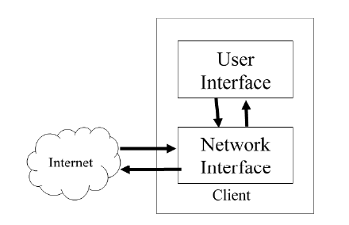

# Graduation-project-Arabic-chatbot
Chatbot for answering COVID-19 FAQs in modern standard arabic (MSA)
- [Objectives](#OBJECTIVES)
- [Methodology](#methodology)
   *  [Process](#Process)
   *  [Data preprocessing](#db)
   *  [Feature Extraction](#fe)
   *  [Testing and Evaluation](#testing)
   *  [Training](#training)
- [Software Structure](#ss)
- [Results](#results)
- [Recommendations](#recommendations)
  

<b name="OBJECTIVES">Objectives :</b> 

The objectives of this project is as follows:

- The chatbot should interact with users using Arabic natural language interface.
- To compare the performance of various text classification algorithms on MSA.
- Study the effect of feature extraction techniques on the performance of classification algorithms.
- Give a recommendations for future scholars who are intended to work in Arabic text classification tasks.
  

<b name="methodology">Methodology :</b> 

<b name="Procss">Process :</b> 

The following Nine classifiers has been trained on this dataset:

- Probabilistic models:
    * Gaussian naive Bayes
    * Complement naive Bayes
    * Multinomial naïve Bayes
- Non-generalizable models:
    * K-nearest neighbors
- Linear models:
    * Logistic regression with L2 regularization
    * Stochastic gradient decent
- Support Vector Machines (SVM) models:
    * Support Vector Machines with polynomial kernel
    * Support Vector Machines with RPF kernel
    * Support Vector Machines with sigmoid kernel

<b name="db">Data Preprocessing:</b> 

- Text cleaning
    * Elongation removal
    * Tashkil removal
    * Punctuation removal
    * Extra spaces removal
    * Similar characters unifying
- Stop words removal
  
<b name="fe">Feature Extraction :</b> 

Feature extraction has been implemented through a pipeline consists of the following processes:
- Term Frequency – Inverse Document Frequency (TF-IDF) vectorization
- Cosine similarity
- Feature normalization

<b name="training">Training :</b> 

The training has been done on the following three datasets:
- init_set dataset with 250 examples and vectorized with 250 vectors
-  vec250 dataset with 600 examples and vecorized with 250 vectors
- vec_all dataset with 600 examples and vectorized with 600 vectors

and their results has been aggregated in two ways:

- Hard voting
- Soft voting

When it is provided with an example each one of the classifiers classifies the examples in into one of the following fifteen target classes:

- animals_infection
- asymptotic_infection
- end_conversation
- life_time
- mailing_packages
- mask_usage
- period_before_symptoms
- Sanitizers
- second_infection
- self_protection
- start_conversation
- Symptoms
- Temprature
- Test
- ways_of_infection

<b name="testing">Testing and Evaluation :</b> 

All classifiers trained on the three training sets are tested using three performance metrics:
- Precision score
- Recall score
- F1 score

Four aspects of performance have been studied:
- The effect of training set size overall performance of each classifier.
- The effect of vectorization technique on the overall performance of each classifier.
- Differences in performance among classifiers trained on the same training set.
- Performance of all classifiers trained on all training sets on individual classes.

<b name="ss">SOFTWARE STRUCTURE :</b> 

CLient side: 

Client inetrface: 

Server side:

The intent classifier module which resides in the server side has been implemented by training the nine classifiers

The dialog manager has been designed with clarification-based method which relies on asking user to clarify its intent and based on his/her answers the dialog will flow.

<b name="results">Results :</b> 

- In terms of overall performance of the classifiers on Arabic text classification task, results showed that Gaussian naïve Bayes, logistic regression with L2 regularization and soft voting techniques has better performance than others.

- Coming to the effect of training set size on classifier’s performance, stochastic gradient decent and SVM techniques in general showed significant improvements in performance as the size of the training set increases, whereas other classifiers showed smaller changes in performance.

- The effect of vectorization method has been noticed obviously in the results, as the performance of all classifiers improves with the number of vectors used to measure similarity.

- In general, more samples need to be collected for all classes, but some classes on which classifiers have very poor performance comparing to others and need more samples to be collected, these classes are:
  * period_before_symptoms
  * self_protection
  * start_conversation
  * Temprature

<b name="recommendations">RECOMMENDATIONS:</b> 

From the work that has done on this project the following recommendations are suggested for future researchers who has intention to work in Arabic chatbots or any other projects involving Arabic text classification:

- There is a scarcity in Arabic textual data, so it is important to develop powerful techniques to collect data that would enable researchers to develop their models.
-  It is also on demand to develop or adopt developed preprocessing techniques, feature extraction tools and performance metrics for Arabic language and have them implemented as a one library that is able to work with python programming language as it is the defacto language of machine learning.
- Till now, no research work has been done in the area of Arabic generative-based chatbots. If in future there was abundance of Arabic textual data it is better use recurrent neural networks to develop generative-based chatbot for Arabic language.
- As the results have showed, when working on Arabic text classification, it is highly recommended to use support vector machines, logistic regression with L2 regularization or an ensemble method on these two techniques first before moving to other classifiers.
- Also from the concluded results, calculating cosine similarity between each document and the entire training set and not only on a part of the training set is preferable as it magnifies the performance gains.
- In this project, no information regarding individual words has been used to extract features from text. We recommend, however, to make use of word embbedings, which better represent the semantics of words.
- On this project only the user intents has been used in the chatbot operation, we recommend for future work to incorporate both the intents and entities in the user input for more accurate results.
- In this project no means of spelling correction is provided when users make typos it will affect the quality of predictions, so it is recommended for future project to incorporate a spelling correction mechanism to avoid false predictions.

## Creators :

**Almustafa Abdulgadir Muhammadhassan Noureddin**

**Mohammed Abualnasr Hanafi Ahmed**

**Safaa Ahmad Muhammad**